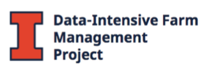

Research over the past 20 years has consistently indicated that crop response to inputs like fertilizers and herbicides are site specific in nature. Every field is different and most years are different. Therefore the OFPE takes advantage of modern technologies to conduct automated experiments on each field that will optimize the use of field-specific inputs based on maximizing farmer profits. The data stream available to agricultural producers can be captured by algorithms that manage data and automates the process of conducting experiments, field by field. Farm managers can build or join a database where each farm and field's data can be stored for incorporation into the OFPE data pipeline, resulting in the simulation of a range of economic and climate futures, providing a basis for management under uncertainty and assessment of resilience. 

**Resources**

OFPE Website: <https://sites.google.com/site/ofpeframework/>

OFPE Package: <https://github.com/paulhegedus/OFPE.git>

OFPE Web Application: <https://paulhegedus.shinyapps.io/OFPE_AnalysisAndSim_App_v1/?_ga=2.189182059.1336631904.1592115204-590292424.1592115204>

OFPE CropScan 3300H Visualization Application: <https://paulhegedus.shinyapps.io/OFPE_Protein_Application/?_ga=2.69643152.1880072526.1592481594-590292424.1592115204>

**Funding**

The OFPE project was initially funded by the Montana Research and Economic Development Initiative ([MREDI](https://mus.edu/research/research_initiative.html)) and was continued to be funded by the Montana Fertilizer Advisory Committee ([MFAC](https://agriculture.montana.edu/mfac/index.html)) and the Data Intensive Farm Management project at the University of Illinois ([DIFM](https://publish.illinois.edu/data-intensive-farm-managment/)) to begin the process of creating an automated on-field experimentation system. Other support and funding has been provided by the Montana State University College of Agriculture ([MSU CoA](https://agriculture.montana.edu)), the MSU Department Land Resources and Environmental Sciences ([LRES](https://landresources.montana.edu)), and the Montana Institute on Ecosystems ([MT IoE](https://montanaioe.org)).

#       

