To properly format the OFPE database, the user needs access to or need to create necessary farm and field boundaries associated with their experimental fields. These farm bounding boxes encompass fields within a farmer's ownership/management purview are imported as assets into Google Earth Engine and imported into the database. These ESRI shapefiles for fields and farms are needed at database creation, but also can be added later to update the database on new or modified farm or field boundaries. See this  [diagram](db_creation.html) for creating or updating the database.

### Tutorial
Follow the directions below for preparing your shapefiles for the OFPE data pipeline. This tutorial shows the process of making a shapefile for a field first, followed by an abridged description of the process for making a shapefile for the field boundary.

First, the tutorial below utilizes [QGIS](https://qgis.org), an open source geographic information system (GIS). You can download QGIS here: <https://qgis.org/en/site/forusers/download.html>. This tutorial will not step through downloading this software. 

Note that one of many other ways to create shapefiles could be by drawing a .kml in [Google Earth Pro](https://www.google.com/earth/versions/#download-pro) and importing to QGIS where it is can be converted to an ESRI shapefile. However, since QGIS is required either way, this tutorial will demonstrate how to draw shapefiles from QGIS.

The tutorial uses a QGIS plugin called [QuickMapService](https://plugins.qgis.org/plugins/quick_map_services/). After QGIS is downloaded follow these steps to download from the QGIS GUI.

**1.** Go to the *Plugins* toolbar, then 'Manage and Install Plugins...'.

```{r, out.width = "75%", fig.align = "center", fig.cap = "", echo = FALSE}
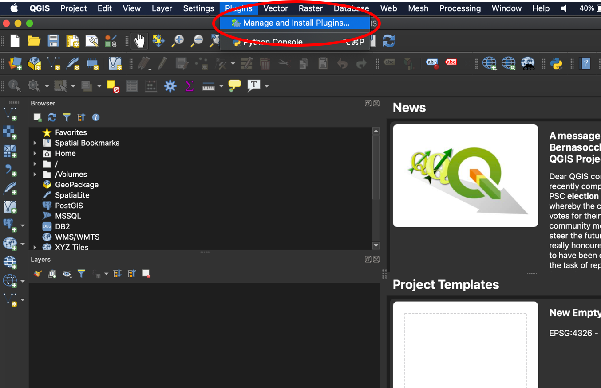
```

**2.** Search for 'QuickMapServices'. In the lower right side of the pane it will say 'Install Plugin'. The image below says 'Reinstall Plugin', which replaces the former button after installation.

```{r, out.width = "75%", fig.align = "center", fig.cap = "", echo = FALSE}
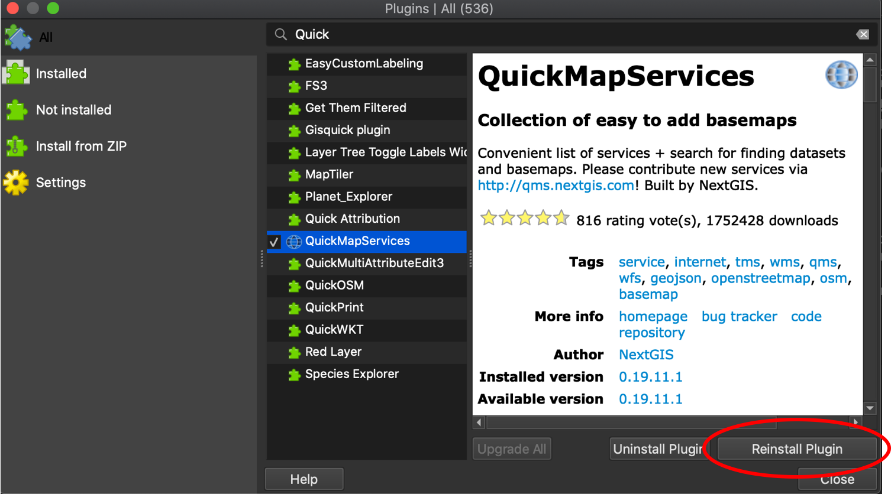
```

**3.** Go to the 'QuickMapServices' button, and select 'Settings' from the dropdown menu. You will not likely have all of the map services here, but the process below will enable these options.

```{r, out.width = "75%", fig.align = "center", fig.cap = "", echo = FALSE}
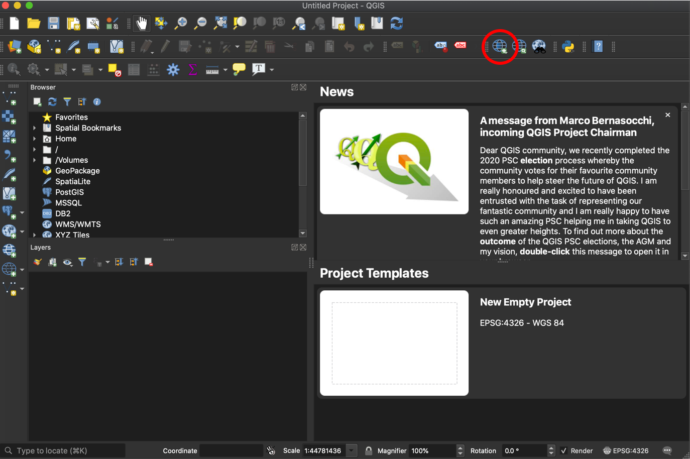
```

```{r, out.width = "75%", fig.align = "center", fig.cap = "", echo = FALSE}
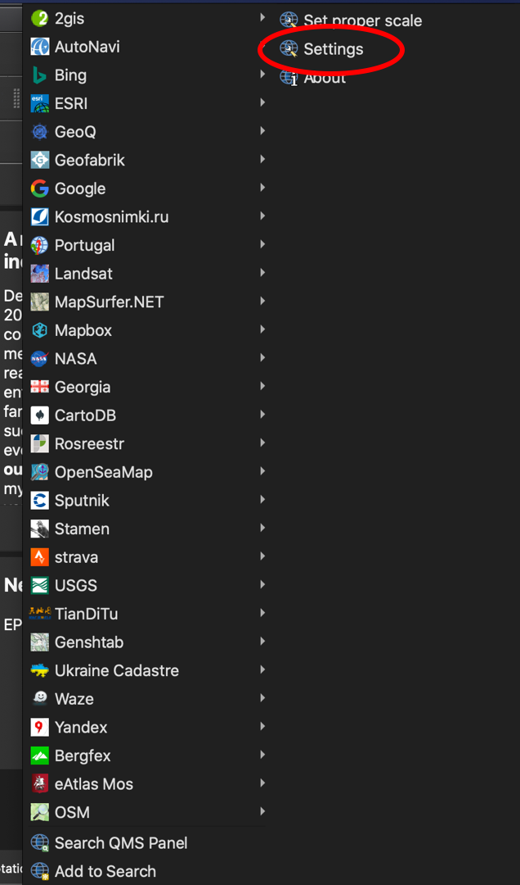
```

**4.** Go to the 'More services' tab, select 'Get contributed pack', let it download, then select 'Save'. You will now have 

```{r, out.width = "75%", fig.align = "center", fig.cap = "", echo = FALSE}
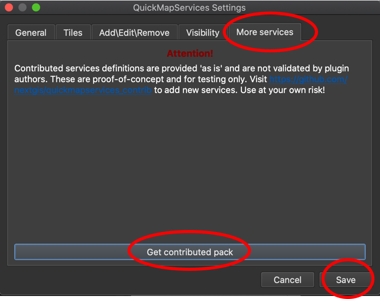
```


### Field Boundary
A field boundary should represent the boundary of an OFPE data-intensively managed field. This is used to identify incoming on-farm data, clip remotely-sensed data, for determining a 30m buffer from the field edge for cleaning, and creating a net of management cells across the field. When creating, make one column in the data named 'id' with an integer indicating the portion of the field. Most fields are continuous and will have a single 'id' of 1, however fields with multiple unconnected sections will have multiple entries for 'id'.

**1.** Open QGIS. If not downloaded, see above. 

**2.** Go to the 'QuickMapServices' button, and select 'Google', then 'Satellite' from the dropdown menus. If these dropdowns are not viewable for you, see above. Any basemap could be selected, but 'Satellite' is easy for outlining fields or farms across a landscape.

```{r, out.width = "75%", fig.align = "center", fig.cap = "", echo = FALSE}

```

```{r, out.width = "75%", fig.align = "center", fig.cap = "", echo = FALSE}
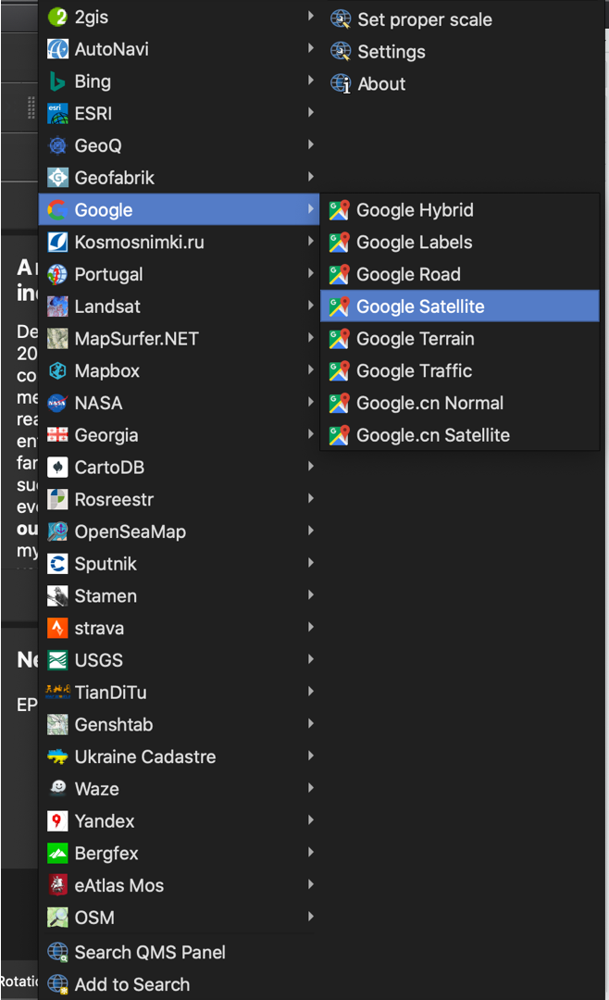
```

**3.** Zoom into where the field is located, then go to 'Layer' >> 'Create Layer' >> 'New Shapefile Layer...'.

```{r, out.width = "75%", fig.align = "center", fig.cap = "", echo = FALSE}
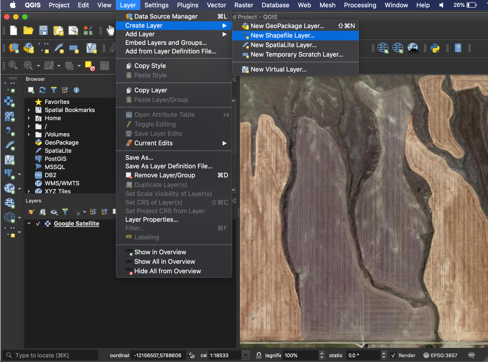
```

**4.** Browse to a location to save your boundary, name it, and click 'Save'. 

```{r, out.width = "75%", fig.align = "center", fig.cap = "", echo = FALSE}
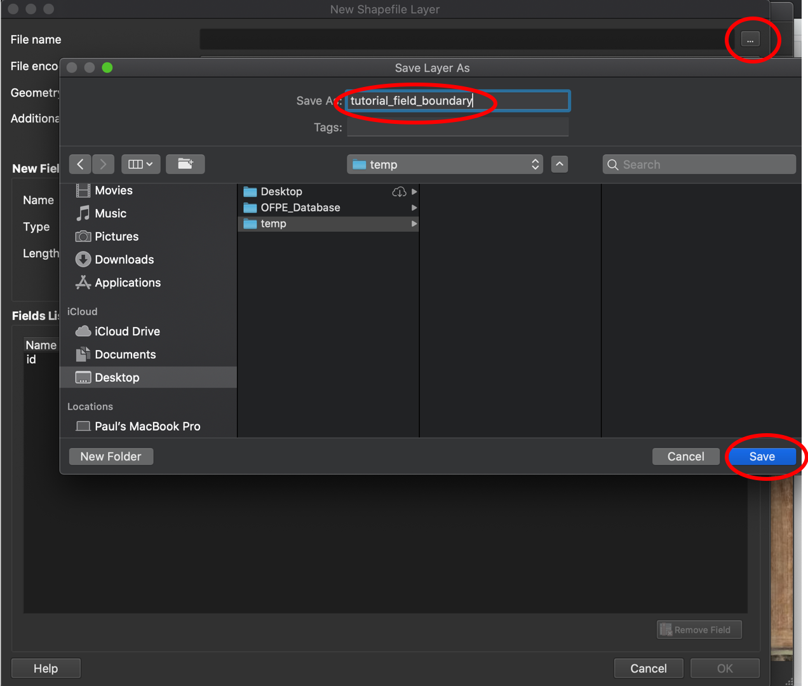
```

**5.** Change the geometry type to 'Polygon'.

```{r, out.width = "75%", fig.align = "center", fig.cap = "", echo = FALSE}
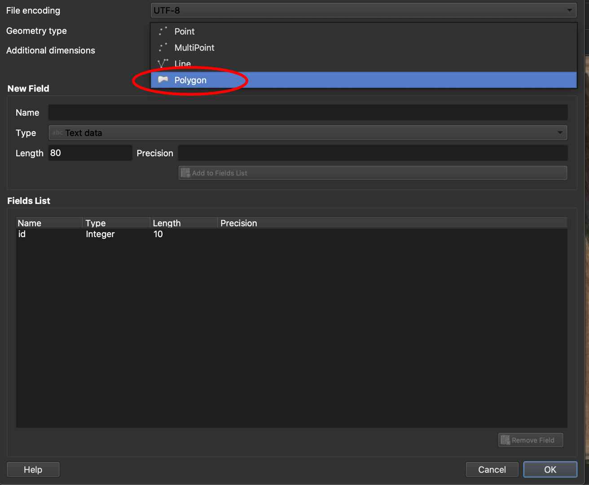
```

**6.** Make sure the projection matches the project you are in (i.e. matches your basemap). Accept the default fields and hit 'OK'.

```{r, out.width = "75%", fig.align = "center", fig.cap = "", echo = FALSE}
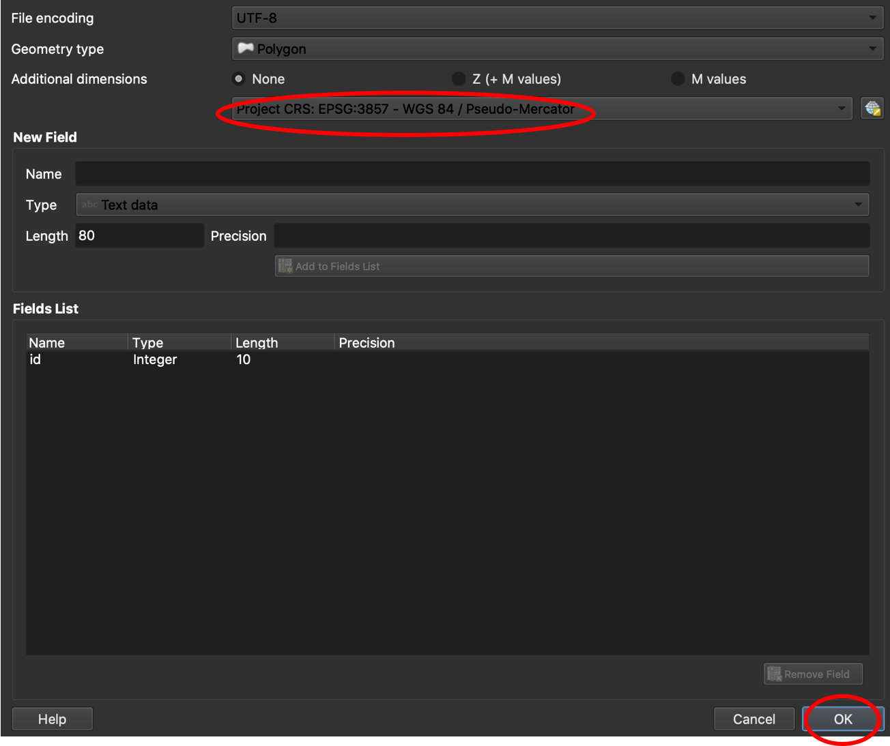
```

**7.** Your new layer will show up in the 'Layers' pane. Select the 'Toggle Editing' button, then the 'Add Polygon Feature' button.

```{r, out.width = "75%", fig.align = "center", fig.cap = "", echo = FALSE}
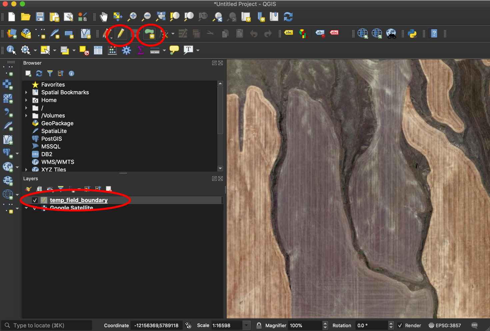
```

**8.** Draw the boundary for your field. If there are separate sections of a field, as in the example, indicate this by specifying the 'id'.

```{r, out.width = "75%", fig.align = "center", fig.cap = "", echo = FALSE}
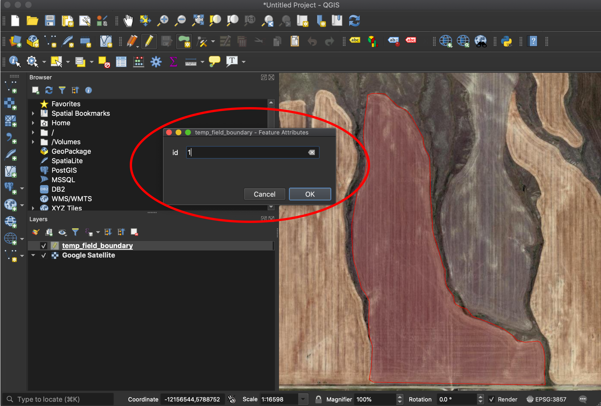
```

**9.** Repeat for any other sections of the field. When finished, select the 'Toggle Editing' button and hit 'Save' to implement your new polygons to the shapefile.

```{r, out.width = "75%", fig.align = "center", fig.cap = "", echo = FALSE}
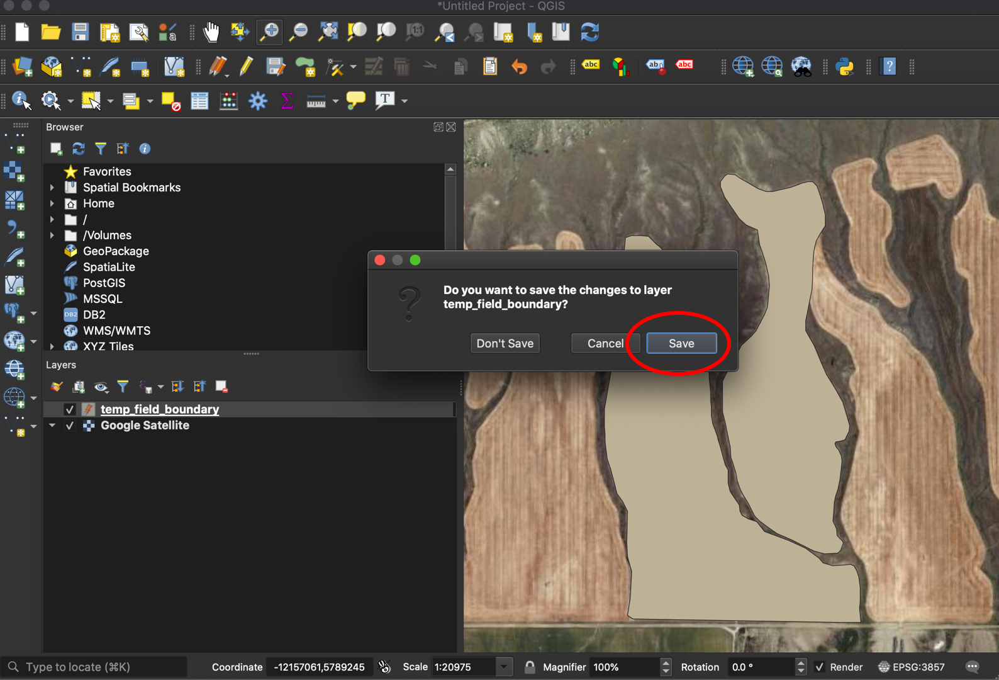
```

You now have a field boundary that can be used in your OFPE database. See this  [diagram](db_creation.html) for where to add in field boundaries to the OFPE data pipeline.

### Farm Bounding Box 
A farm bounding box should be a polygon that surrounds the fields of the owning/managing farmer. It does not need to trace property or management lines, but cannot cover another farmer's OFPE field. If it covers another farmer's fields, the farm bounding box cannot 1) cover another OFPE farmer's field or 2) if covering another OFPE farmer's field, that field cannot be used for analysis or experimentation. When creating, make one column in the data named 'id' with an integer indicating the portion of the field. Most fields are continuous and will have a single 'id' of 1, however fields with multiple unconnected sections will have multiple entries for 'id'.

**1.** Follow Steps 1 - 7 from the **Field Boundary** section.

**2.** Draw the farm bounding box around all fields under ownership or management of the farmer of interest.

```{r, out.width = "75%", fig.align = "center", fig.cap = "Note how the bounding box does not follow property lines or field boundaries. It is a general bouning box around the fields that the farmer owns or manages.", echo = FALSE}
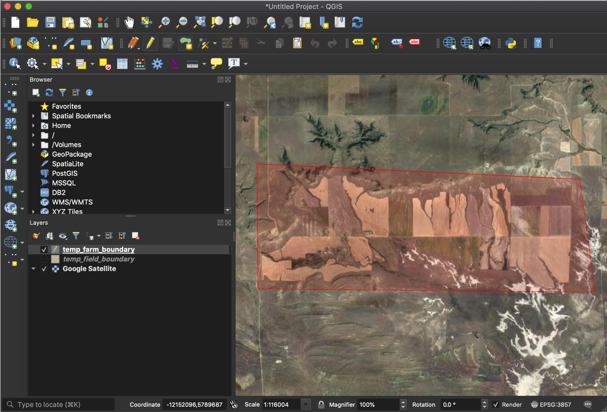
```

**3.** Follow Step 9 from the **Field Boundary** section to save the shapefile.

You now have a farm boundary box that can be used in your OFPE database. See this  [diagram](db_creation.html) for where to add in farm bounding boxes to the OFPE data pipeline.


