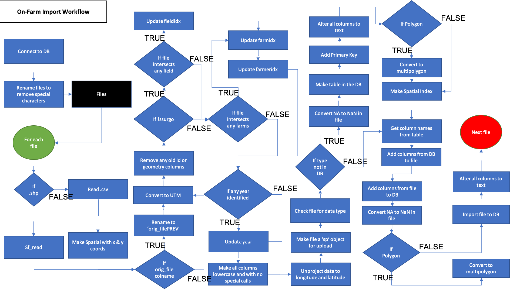
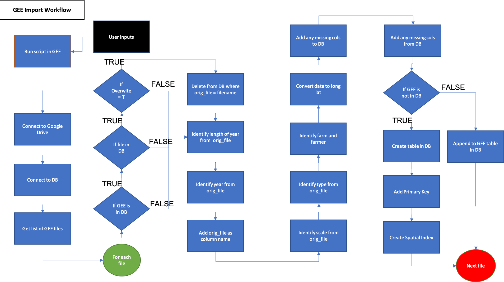
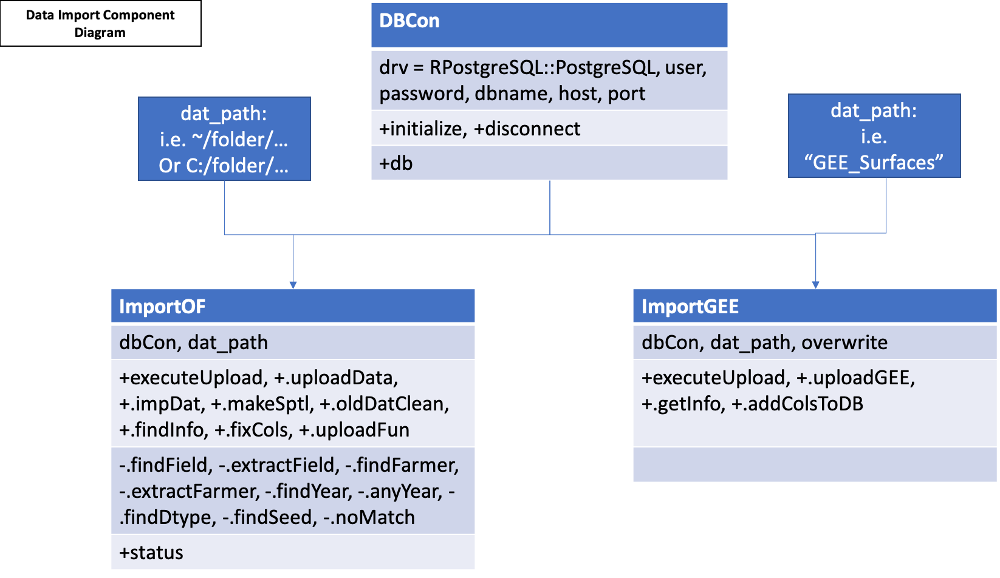

The stream of data available from agricultural fields include data collected from farm machinery during normal farm operations such as seeding, spraying, and harvesting. Additionally, there is a vast amount of data available from remotely sensed satellite or sensor data.

#### On-Farm Data
The OFPE project focuses on winter wheat yield and protein as response variables and nitrogen fertilizer or seed rates as explanatory variables, depending on whether the field is farmed conventionally or organically, respectively. These data are collected from the farm machinery as ESRI Shapefiles, barring CropScan protein data that is gathered as a comma-separated values file. These .csv files can be visualized using this [web application](https://paulhegedus.shinyapps.io/OFPE_Protein_Application/?_ga=2.69643152.1880072526.1592481594-590292424.1592115204). These data can be batch uploaded to the database through a script that automatically identifies and organizes each upload.

The process for importing on-farm data to the database is outlined in the activity diagram below (Figure 1), and covers the pre-processing to the data upload steps.

```{r, out.width = "75%", fig.align = "center", fig.cap = "**Figure 1**. The on-farm data import process. Demonstrates pre-upload data processing and upload of data to database. Blue activities are chained together by arrows, and black boxes indicate the addition of user inputs. Diamonds represent logical statements, where FALSE returns are routed from the side of the diamond and TRUE returns are routed from the top or bottom of the diamond.", echo = FALSE}

```

#### Google Earth Engine Data
Remote sensing data is collected from Google Earth Engine and includes data temporally variable data such as weather and static data such as topogrophy. The user is responsible for running the Google Earth Engine Javascript code to download data for each year required. See this [tutorial](gee_setup.html) for adding farm boundaries to GEE as asset and this [tutorial](run_gee.html) for editing and using Javascript code. 

This data is downloaded to Google Drive, where the data can be batch uploaded to the database. See this [tutorial](gd_setup.html) for setting up Google Drive to receive your data from Google Earth Engine.

The process for importing Google Earth Engine data to the database is outlined in the activity diagram below (Figure 3), and requires the external step of running the script in Google Earth Engine.

```{r, out.width = "75%", fig.align = "center", fig.cap = "**Figure 2.** Google Earth Engine data import process. Demonstrates upload of data to database. Blue activities are chained together by arrows, and black boxes indicate the addition of user inputs. Diamonds represent logical statements, where FALSE returns are routed from the side of the diamond and TRUE returns are routed from the top or bottom of the diamond.", echo = FALSE}

```

### Component Diagram
A component diagram outlining the R6 classes used and the inputs required for the import of data from farms and from Google Earth Engine is represented below in Figure 4. Each class is represented by a table with the title of the class as the header, with the first row showing inputs, the second row showing public methods, the third row showing private methods, and an optional fourth row showing any tangible outputs from the class. Most methods have nothing to return as their functions modify the OFPE database.

```{r, out.width="100%", fig.align="center", fig.cap="**Figure 3.** Component diagram of the data import workflows. Both the ImportOF and ImportGEE classes take an object of the DBCon class and a path to either the folder on the user's local machine in which their on-farm data is stored for import, or the folder name in the user's Google Drive that contains their GEE data stored for import.", echo = FALSE}

```


