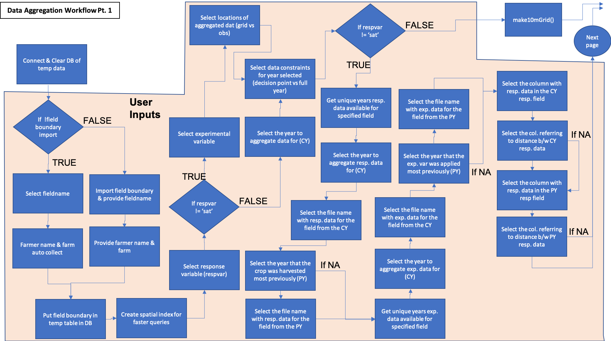
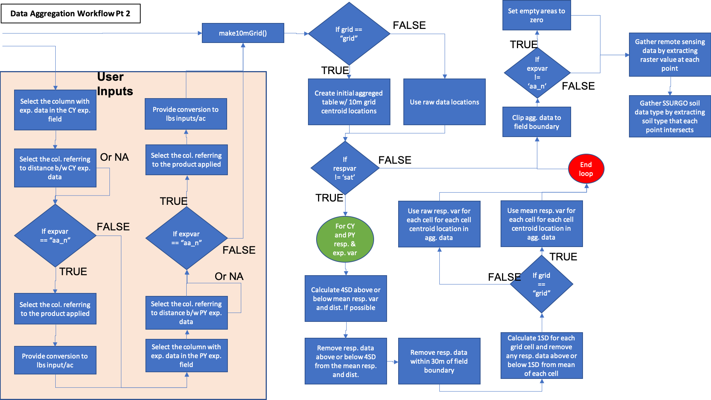

Raw data from various sources need to be wrangled and aggregated together before statistical analysis and model development. Because yield and protein data are related to crop production and quality, the source of winter wheat value, covariate and explanatory data are used to enrich yield and protein datasets Due to equipment differences, yield and protein are gathered at different temporal resolutions (3 and 10 seconds, respectively) and subsequent spatial resolution, so are treated as separate datasets and not combined based on interpolation or estimation of protein data. The OFPE project aims to use the finest resolution of data possible to make decisions with data that has as little natural variation removed as possible.

#### Enrich Datasets
The activity workflow for enriching yield and protein datasets is described below in Figure 1 and 2. I use the term enrichment to describe the process of aggregating all of the data from disparate sources to the response data of interest (yield or protein). The process requires the user to select the field to aggregate data for, the type of response variable (yield or grain protein content), the type of data experimented with (nitrogen fertilizer or seeding rates), the years to aggregate data for, whether to aggregate data to the centroid of 10m grid cells across the field or the raw observed data locations, and the time constraint for which to gather data for the year selected. The user can select the decision point at the end of March when farmers have to make nitrogen fertilzier application decisions, or the end of August after harvest so that data is collected to the point of observation. The difference is explored in this [paper](ch.2 of paulhegs dissertation).

```{r, out.width = "75%", fig.align = "center", fig.cap = "**Figure 1**. Part 1 of the data aggregation process. Demonstrates enrichment of yield or protein datasets with remotely sensed covariate data and experimental data collected on-farms. Blue activities are chained together by arrows, and black boxes indicate the addition of user inputs. Diamonds represent logical statements, where FALSE returns are routed from the side of the diamond and TRUE returns are routed from the top or bottom of the diamond.", echo = FALSE}

```

```{r, out.width = "75%", fig.align = "center", fig.cap = "**Figure 2**. Part 2 of the data aggregation process. Demonstrates enrichment of yield or protein datasets with remotely sensed covariate data and experimental data collected on-farms. Blue activities are chained together by arrows, and black boxes indicate the addition of user inputs. Diamonds represent logical statements, where FALSE returns are routed from the side of the diamond and TRUE returns are routed from the top or bottom of the diamond.", echo = FALSE}

```

A component diagram outlining the R6 classes used and the inputs required for the aggregation of on-farm and Google Earth Engine data is outlined below in Figure 3. Each class is represented by a table with the title of the class as the header, with the first row showing inputs, the second row showing public methods, the third row showing private methods, and an optional fourth row showing any tangible outputs from the class. Most methods have nothing to return as their functions modify the OFPE database.

```{r, out.width='100%', fig.align='center', fig.cap='**Figure 3.** Component diagram for the data aggregation workflows. ... .', echo = FALSE}

```


