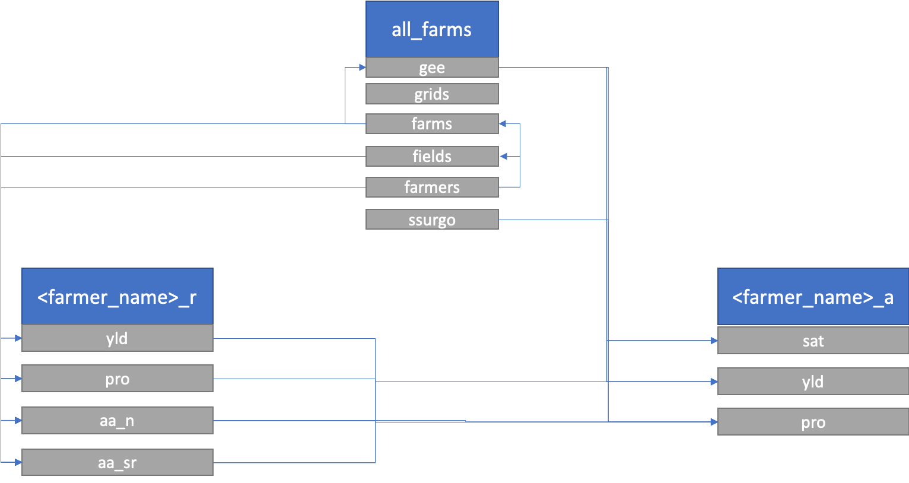
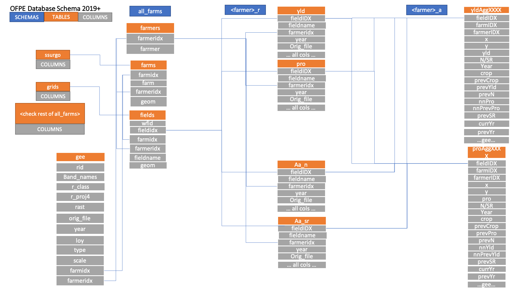

The OFPE process begins with the creation of a spatial database for storing data gathered from farms and from satellite sources. This database is set up in  a specific OFPE format to support the ensuing workflow and requires the user to specify the boundaries of fields selected for data intensive management and the farm boundary within which a farmer's fields fall. This is a one-time process where once the database is set up it will only need management to keep it up to date.

The user will need access to an OFPE formatted database or need to create their own. In order to do this, see this [tutorial](postgres_setup.html) for downloading PostgreSQL and setting up a local postgres server. If using a preexisting database, the user will need the host, username, password, and database driver.

#### Database Schematic
The database schematic is simplistically outlined below in Figure 1. There is one 'all_farms' schema with data that is not field specific, and two schemas per participating farmer. See the caption of Figure 1 for more information. The database uses key value pair relationships when possible, however, because farmers mislabel or rename fields on an annual basis spatial relationships are relied upon. The creation of the database with experimental field edges and farm bounaries are the only items needed for the OFPE algorithms to identify and organize incoming data. If data imported intersects more than 75% with an experiment field boundary stored in the database, the field is classified and organized appropriately with a field name identified. Otherwise, the incoming data is queried against the farm boundaries to identify a farmer at least. Figure 1 below demonstrates the contribution/spatial relation of various tables to others.

```{r, out.width = "75%", fig.align = "center", fig.cap = "**Figure 1.** OFPE database design. Blue boxes represent schema names and gray boxes represent tables within each schema. The all_farms tables are 'gee' = Google Earth Engine data, 'grids' = 10m grids laid across file, 'farms' = farm boundaries and information., 'farmers' = farmer identifiaction, 'fields' = experimental field boundaries and information, and 'ssurgo' = SSURGO soil data. For every farmer, there is a '_r' and '_a' schema associated, for raw and aggregated data, respectively. In the raw schema there are tables for yield ('yld'), protein ('pro'), and as-applied nitrogen ('aa_n') and seed rates ('aa_sr'). The aggregated schema contains data aggregated to the raw yield points ('yld') or raw protein points ('pro'). Remotely sensed data from Google Earth Engine can be aggregated to the centers of the 10m grids without any on-farm data for any year satellite data is available ('sat').", echo = FALSE}

```


The relational aspect of the database is represented below, where schmas are generally defined as space in the diagram, tables are visualized with orange headers, and examples of column names are shown with gray boxes. *The column names shown are not an exhaustive list of columns present in actual data.*

```{r, out.width = "75%", fig.align = "center", fig.cap = "**Figure 2.** TODO: Update figure.** OFPE database schematic. Legend is in top left. Blue boxes represent schemas within the database. Orange boxes represent tables within schemas, and grey boxes are columns within each table. Demonstrates the relational aspect of the database. *The column names shown are not an exhaustive list of columns present in actual data.* ", echo = FALSE}

```


#### Build/Update Database
The user will need access to or need to create necessary farm and field boundaries associated with their experimental fields to set up their database. These farm boundaries that encompass the fields within a farmer's ownership/management purview are imported as assets into Google Earth Engine and imported into the database. See this [tutorial](create_shp_qgis.html) for creating a shapefile of a field or farm boundary. These are necessary for identifying data based on geographic location rather than searching files for information keying in on field or farm specific information. Farm boundaries are also used as the bounding boxes for downloading Google Earth Engine data.

The process for creating a database is outlined in the activity diagram below (Figure 3). The user needs some field and farm boundaries to create the database, however field and farm boundaries can be added or modified later by connecting to the database and running the 'Add X' modules.

```{r, out.width = "75%", fig.align = "center", fig.cap = "**Figure 3.** Blue processes are chained together by arrows indicating the next step in the workflow, and black boxes indicate the addition of user inputs.", echo = FALSE}
knitr::include_graphics('diagrams/ofpe_db_mgmt.png')
```


A diagram demonstrating the implementation and existence of modules related to the database creation and management can be seen below (Figure 4). This is a component diagram outlining the R6 classes used and the inputs required for the creation and management of the OFPE database. Each class is represented by a table with the title of the class as the header, with the first row showing inputs, the second row showing public methods, the third row showing private methods, and an optional fourth row showing any tangible outputs from the class. Most methods have nothing to return as their functions modify the OFPE database. 

This diagram also implements elements of an activity diagram to represent the assortment of optional ways to run the methods. The BuildDB class is used once to build the initial OFPE database. When new farmers are added or new farm or field boundaries are added to the database, the ManageDB class should be used. The user has the option of choosing which other management classes they want to run. Any combination of these can be run, however it is recommneded that logic be used when running these methods. For a farm or field boundary to be connected to a specific farmer, that farmer's information needs to be uploaded to the database first. For a field to be connected to a farm, the farm boundary and information needs to be uploaded first. 

```{r, out.width = "75%", fig.align = "center", fig.cap = "**Figure 4.** Component diagram of the database management workflow. A database connection is established using the DBCon class and the BuildDB class is used to format the OFPE database. The ManageDB class calls other classes of the same interface that are specified by the user.", echo = FALSE}

```
