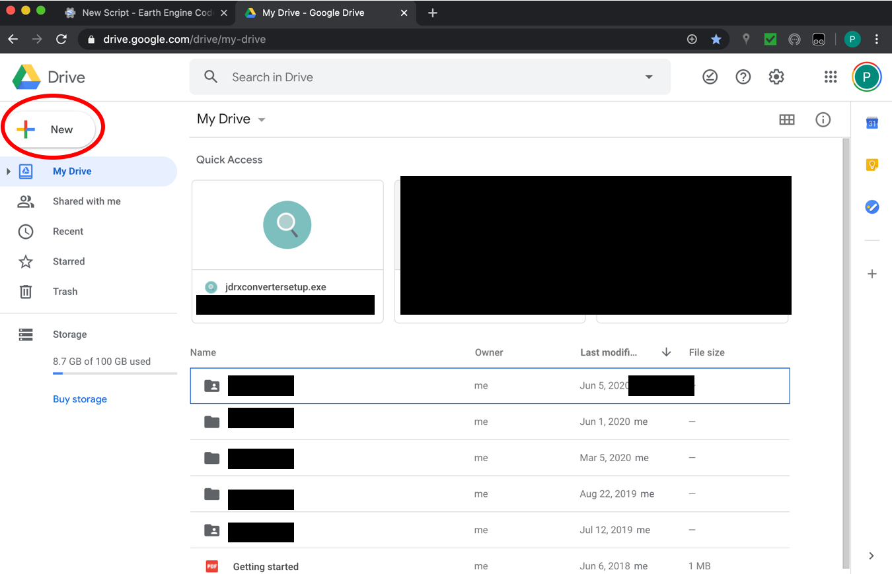
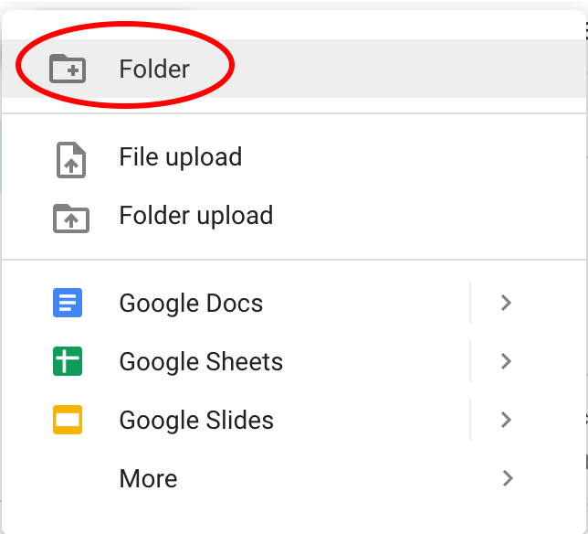
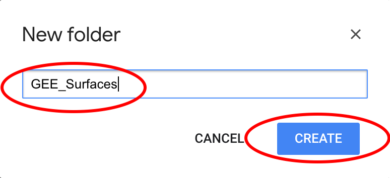

Open source, remotely sensed satellite data collected from [Google Earth Engine](https://earthengine.google.com/) are downloaded to [Google Drive](https://www.google.com/drive/) in the OFPE data pipeline. The data is downloaded to Google Drive from Google Earth Engine, where the data can be batch uploaded to the PostgreSQL database. See the [OFPE framework](ofpe_overview.html) page for a diagram of the Google Drive incorporation.

### Tutorial
This tutorial is for setting up a Google Account and Google Drive to receive your data from Google Earth Engine.

**1.** A Google Account is needed. If the user does not already possess this, follow Steps 1 - 2 of the [Google Earth Engine Set Up](gee_setup.html) tutorial.

**2.** Go to [Google Drive](https://www.google.com/drive/) and sign in, hit the big 'New' button from your home page.

```{r, out.width = "75%", fig.align = "center", fig.cap = "", echo = FALSE}

```

**3.** Select 'Folder' and name it *GEE_Surfaces*, then click 'Create'. If you name it something other than *GEE_Surfaces* you will have to **edit** the Google Earth Engine code provided in this [tutorial](run_gee.html) to reflect your change. This is not covered in the tutorial so as the user you will take responsibility for any ensuing breakages in the code.

```{r, out.width = "75%", fig.align = "center", fig.cap = "", echo = FALSE}

```

```{r, out.width = "75%", fig.align = "center", fig.cap = "", echo = FALSE}

```

Now there is a specific folder that the Google Earth Engine code will look for to save remotely sensed data.


