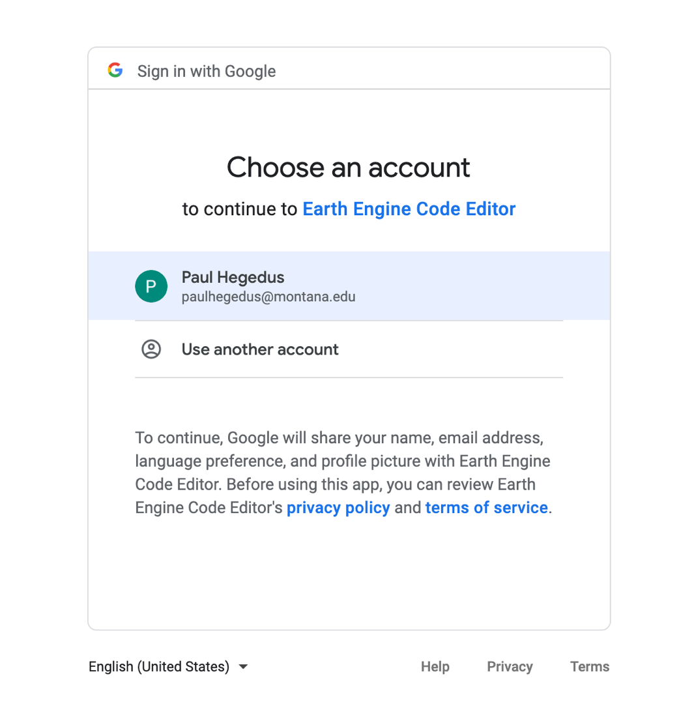

This tutorial is meant for showing users how to upload farm bounding boxes made in the [Create Shapefile](create_shp_qgis.html) tutorial to Google Earth Engine. These farm bounding boxes encompass each respective farmer's OFPE fields, and are the area of interests for the remotely sensed satellite data collected from Google Earth Engine.

### Tutorial
Before uploading farm bounding boxes as 'Assets', the user needs to go to [Google Earth Engine](https://earthengine.google.com/) and request an account through the 'Sign Up' button.

**1.** From the Google sign in page, select 'Create account' if you do not have a Google Account. Otherwise sign in and skip to Step 3.

**2.** Fill out each step of the process.

**3.** After you have a Google Account, go back to [Google Earth Engine](https://earthengine.google.com/) and click 'Sign Up'. Fill out each step of the process and receive verification.

**4.** Go to the [Google Earth Engine Code Editor](https://code.earthengine.google.com/) page and sign into your account. Allow Earth Engine Code Editor to access your Google Account. Now you should have access to the Google Earth Engine Code Editor window.

**5.** Go to the 'Assets' tab in the pane on the right side, and click the big red 'NEW' button, and select 'Shape files'. 

**6.** Browse to the directory of the farm bounding box you are uploading by clicking the red 'SELECT' button. Select the .shp, .shx, .dbf, and .prj file extensions for the specified shapefile. Amend the name if desired. OFPE convention is '*farmer*_*farmname*_bbox'. Click 'Upload'.

**7.** After uploading, the 'Tasks' tab in the right side pane should appear orange. If you click on the orange 'Tasks' tab, a process should be present that indicates that Google Earth Engine is ingestin the asset.

Now the farm boundary will always be available in the 'Assets' tab of Google Earth Engine, and can be imported and used in your scripts. 

