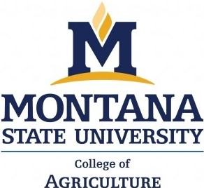

#  

The On-Farm Precision Experiments Framework was developed at Montana State University in 2015. This webpage contains technical information about the OFPE framework and data process and is a complement to the README and vignettes available in the [OFPE R Package](https://github.com/paulhegedus/OFPE). This website assumes the reader has a familiarity with the project, please refer to the [OFPE website](https://sites.google.com/site/ofpeframework/) for more information or the [About](about.html) page for a light explanation.

You can install the released version of the OFPE R package from [GitHub](https://github.com) with:

``` r
# install.packages("devtools")
devtools::install_github("paulhegedus/OFPE")
```