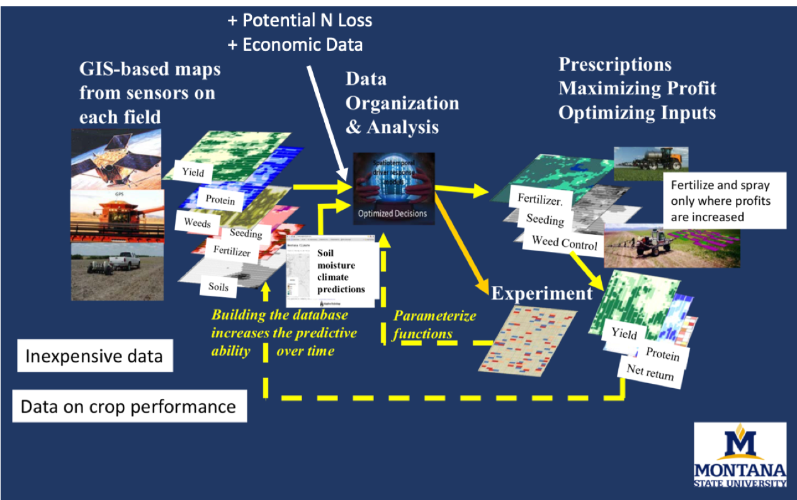

The vignettes of the OFPE package follow the OFPE framework workflow. This process consists of creating a database with user specified field and farm data, importing data collected on-fields and from open sources, enriching yield and protein datasets, analyzing response of yield and protein to variable input rates, predicting net-return outcomes of management strategies, and generating site-specific prescriptions of inputs.

The process follows the OFPE framework below where on-farm and open source data are combined to generate a low cost decsion aid for dryland winter wheat producers. The virtuous cycle of experimentation and data collection makes predictions stronger year after year. See [Lawrence et al. 2015](http://weedeco.msu.montana.edu/publications/pdfs/Lawrence_etal_2015.pdf) for an anaysis of the time it takes for OFPE to pay off.  

#### OFPE Data Schema
Below are schematics of the general On-Field Precision Experiments data workflow and a more detailed diagrma.

