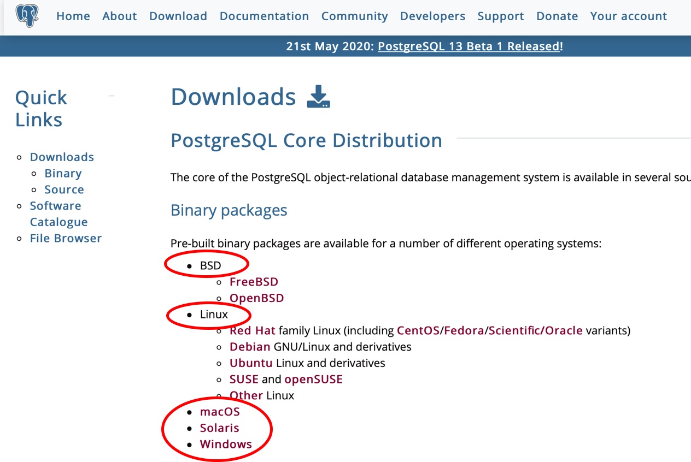
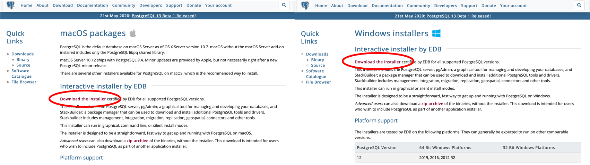
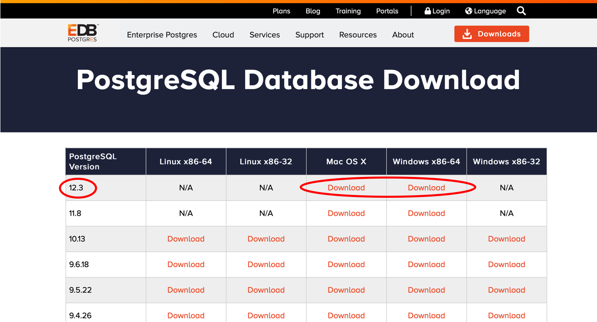
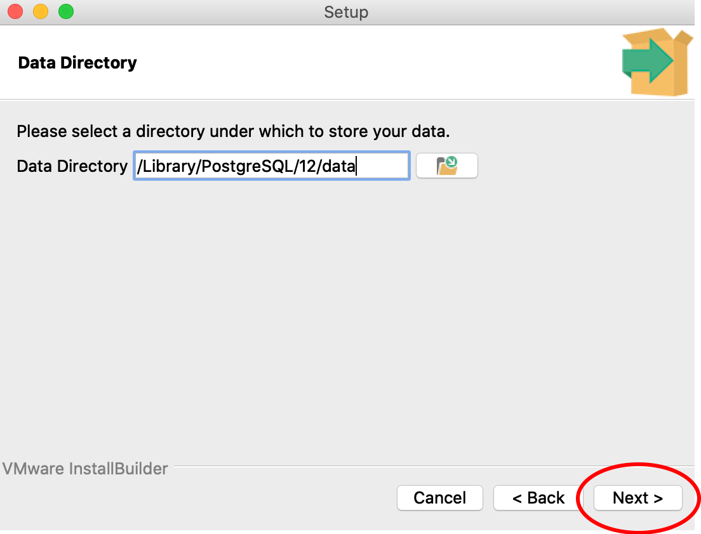
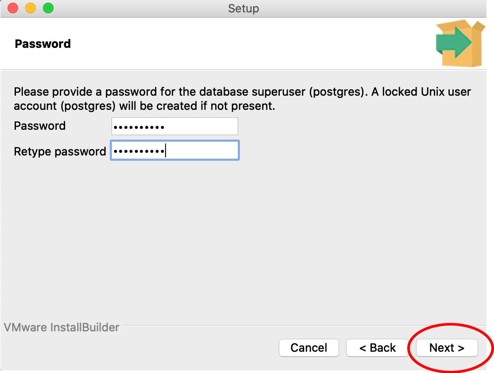
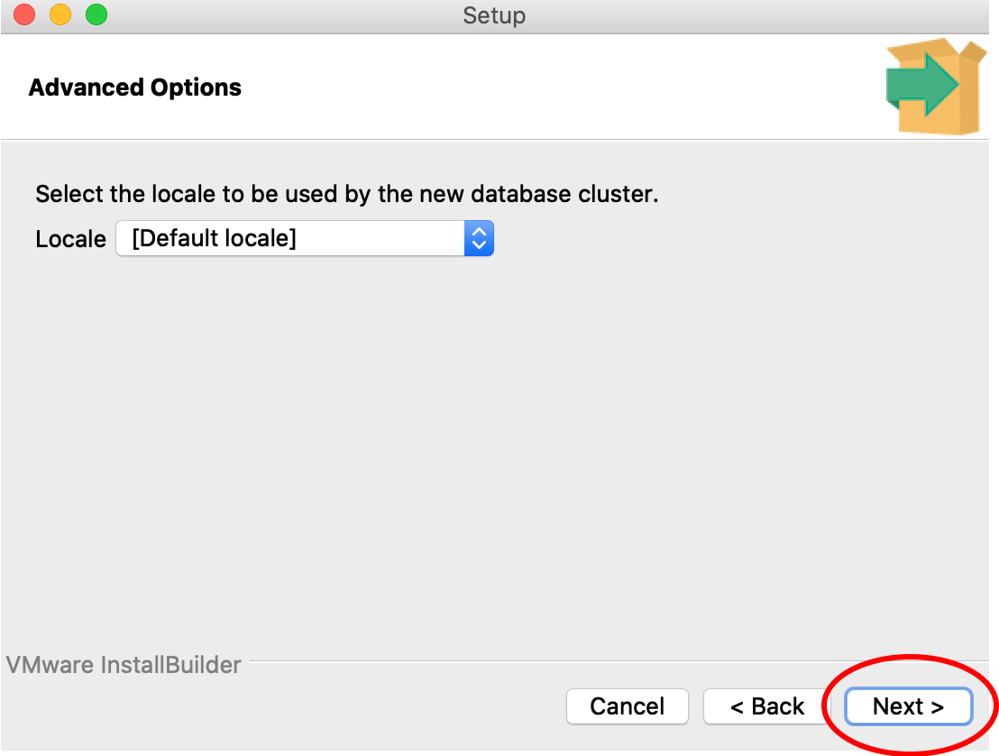
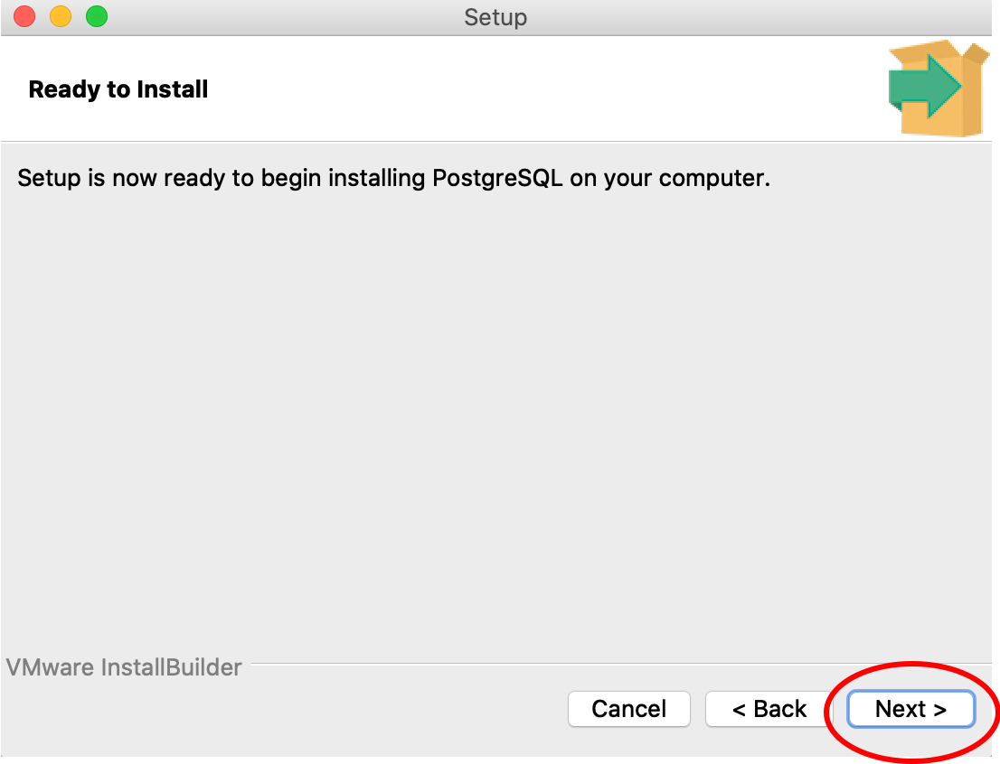

PostgreSQL is an open source relational database system and has the PostGIS geospatial database extension, which was the draw for using this database infrastructure for the OFPE project. All of the data gathered in the OFPE data stream is spatial data from fields that range from tens to hundreds of acres, making the PostGIS extension invaluable in handling and organizing the potentially huge datasets.

The following tutorial describes the process of downloading and setting up PostgreSQL and setting up a local server. This tutorial is not need if the user is using a preexisting database that has been set up in the OFPE format. If so, the user will need the host, username, password, and database driver to connect. After setting up PostgreSQL, proceed to the database creation [diagrams](db_creation.html) and  [vignette](https://github.com/paulhegedus/OFPE/blob/master/vignettes/A1-DB_Create.Rmd) to begin the process of creating a database in the OFPE format. The user may need to proceed to the [tutorial](create_shp_qgis.html) for creating shapefiles for farm and field boundaries.

### Tutorial
Follow the directions below for preparing your system for the OFPE data pipeline.

**1.** Go to the PostgreSQL website: <https://www.postgresql.org> 

**2.** Browse to the 'Download' page.

**3.** Select the link for the appropriate operating system. This tutorial uses the 'macOS' download process. Differences to the Windows process will be pointed out.

**4.** Follow the 'Download the installer' hyperlink. This is present on both the 'macOS' and 'Windows' pages. This link goes to the same place. The EDB installer is selected because it also installs [pgAdmin](https://www.pgadmin.org), a useful GUI for interfacing with your PostgreSQL database.

**5.** Select the 'Download' link for your operating system. It is a good idea to download the latest version. You may need to allow downloads from this website.

**6.** Open the downloaded installer from your 'Downloads' folder. The 'macOS' installer is a .dmg and 'Windows' installer is a .exe. The opening process may be different in the Windows process than the images below. The user may need to enter their password to allow the download, depending on your system settings.

**7.** Follow the instructions in the PostgreSQL Setup wizard to download the software until the step where a password for the 'postgres' superuser (Step 8). This may look different in a Windows system compared to the images below. Use all of the default options.

**8.** You need to supply a password for the 'postgres' superuser. This is the superuser that the locally hosted database in the OFPE format uses. Note, you will need to remember this password for future use. Leave the port number as the default 5432 and proceed with the rest of the defaults through the installation.

**9.** After the installation has completed, there should be a *pgAdmin* application. This will open the *pgAdmin* GUI in your preffered web browser. Upon opening, you will need to give a password to be your master password for *pgAdmin*. This will require inputting a password and selecting "Reset Master Password". Then select the 'Servers' drop down and enter the password for the 'postgres' superuser you made in Step 8. The PostgreSQL server dropdown should show the default 'postgres' database.

**10.** Now, we are ready to create our database. Go to the 'Object' tab, select 'Create', then 'Database...'.

**11.** Now, type your desired database name in the 'Database' field of the pop-up window. Then click Save. In this example I used a database name called 'OFPE'.

**12.** Now you are all set up with PostgreSQL with a 'postgres' superuser that will be used for creating the OFPE formatted database. Proceed to the database creation [diagrams](db_creation.html) and  [vignette](https://github.com/paulhegedus/OFPE/blob/master/vignettes/A1-DB_Create.Rmd) to begin the process of creating a database in the OFPE format. The user may need to proceed to the [tutorial](create_shp_qgis.html) for creating shapefiles for farm and field boundaries.

