Remote sensing data is collected from Google Earth Engine and includes data temporally variable data such as weather and static data such as topogrophy. The user is responsible for running the Google Earth Engine Javascript code to download data for each year required. See this [tutorial](gee_setup.html) for adding farm boundaries to GEE as asset and this [tutorial](gd_setup.html) for setting up Google Drive to receive your data from Google Earth Engine. See the diagrams on this [page](dat_import.html) for an overview of the Google Earth Engine data download.

Besides the section on creating the Google Earth Engine Javascript, the tutorial below outlines a workflow that should be repeated on an annual basis to download data for the past and current year (up to March 30th). Any parameters can be turned off, any selection of farms can be selected, and any years can be selected by the user. 

### Description
This code is for looping through a sequence of specified years for all farms and downloading all GEE variables for a specified year. The code takes the user selected years and downloads all data for that year up until 03/30. It also downloads the full year's worth of data for the previous year. This means that the least recent year of data in the database will be 1 minus the least recent year specified in the user selection. The user can select a sequence of years in order, or a string of years to download data for. This code was developed for efficiently downloading previous years data from GEE. However, because the user can specify specific years, this code can be used as the annual run once per year and will download all the variables needed for all the farms for the current year (up to mar) and previous year (full year) when 1 year is specified.In the database these are distinguished by a column labeled 'mar' or 'full' for up to march and full year, respectively. Note that water years are from November 1 to October 31. User also has control over what variables to collect so not all vars are collected if not desired.

Precipitation and growing degree day information is collected from GRIDMET by the Idaho EPSCoR project and is 4 km resolution with data available from 1979. It is also collected from Daymet V3, by the NASA ORNL group, which is preferred due to it's 1km reolution. The surfaces data is collected from the USGS National Elevation Dataset at a 10 m scale from prior to 1999. The vegetation index data is collected from different sources based on the date requested. All data 2018 or later are 10 m resolution filtered top of atmosphere measures from the EU's Copernicus Sentinel 2. Prior to 2018 cy and 2016 py, data is collected from Landsat 5 if before 2012, Landsat 7 for 2012/2013, and Landsat 8 for after. Landsat 8 is collected until present to gap fill. S2 provides NDRE and CLRE (should be CIRE) bands for calculating. For Canadian farms the data is collected from NASA ORNL DaymetV3 at a 1km scale exclusively because the USGS NED is not available. These are estimates. Elevation data is from the National Elevaiton dataset at 10m scale for the USA and from the Canadian Digital Elevation Model at a 20m scale for elevation and SRTM from NASA at a 30m scale for slope, aspect, tpi.

### Naming Convention
The naming convention for these files are important for the import of the data to the OFPE database. Again, you need to have a Google Drive folder set up with a folder called 'GEE_Surfaces' to receive these files. See this [tutorial](gd_setup.html) if not set up already. The import code is relatively rigid because this GEE data is under our control and we can nameand format how we like. The import code gathers information about the data from the name of the file so the naming convention becomes important. It would be easiest if these were not changed.

**GENERAL FORMAT:** *farmername*_*scale*_*datasource*_*measure*_*current/previous year*_*year*_*loy*. 

+ *e.g.* “*farmer*_*farmname*_clre_20m_2013_mar” = 20 m resolution clre data from 2013 up until 03/30 for *farmer*'s fields at *farmname*
+ *or*  “*farmer*_*farmname*_4km_gdd_prevYr_2018” = 4km gdd data from 2018 for *farmer*'s fields at *farmname*

**IMPORTANT:** If you change the name of any variable in the filenames, or if you use a new scale, check the GEE import script source code for compatibility.


### Tutorial
This tutorial assumes that the user has already set up a [Google Earth Engine](https://earthengine.google.com/) and [Google Drive](https://www.google.com/drive/) account. Additionally, it assumes the user has followed the setup instructions in this [tutorial](create_shp_qgis.html), this [tutorial](gee_setup.html), and this [tutorial](gd_setup.html). 

### Script Creation
This section of the tutorial is for gathering the OFPE script for gathering all relevant Google Earth Engine (GEE) data. 

**1.** Download the Javascript code developed for the OFPE project and open the file. This code can also be found [here](https://github.com/paulhegedus/Google_Earth_Engine/blob/master/OFPE/ogpe_gee_javascript.txt).

```{r, echo=FALSE}
xfun::embed_file("run_gee/ofpe_gee_javascript.js",
                 "ofpe_gee_javascript.js",
                 "Download OFPE GEE Code")
```

```{r, out.width = "75%", fig.align = "center", fig.cap = "First few lines of the GEE OFPE code. This view is of TextEdit on a Mac.", echo = FALSE}
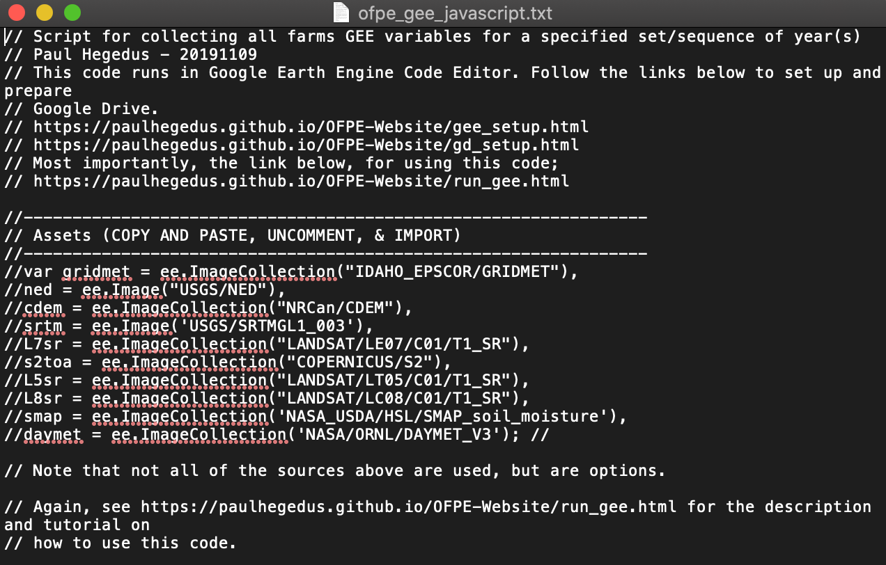
```


**2.** Browse to the [Google Earth Engine Code Editor](https://code.earthengine.google.com/) and hit the red 'NEW' button in the left sided pane. Select and create any 'Repository' or 'Folder' objects, then create a new file. These can be named anything that you would like. You will need to make at least one repository.

```{r, out.width = "75%", fig.align = "center", fig.cap = "Note that you will likely not have any repositories in the left side pane of the Google Earth Engine page. Follow the steps for any repositories or folders you desire before creating the file.", echo = FALSE}
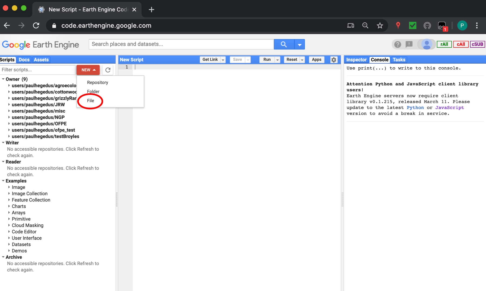
```


**3.** Copy the text in the .txt file downloaded in Step 1 and paste it into the new file made in Step 3. You may need to browse to your new file. The open file name will appear at the top in the blue bar. DO NOT EDIT OR ADD ANY CODE YET. Wait until after following the end of this section. The next few steps refer to lines of code in the file downloaded in Step 1. 

```{r, out.width = "75%", fig.align = "center", fig.cap = "Paste the code from 'ofpe_gee_javascript.txt', downloaded in Step 1.", echo = FALSE}
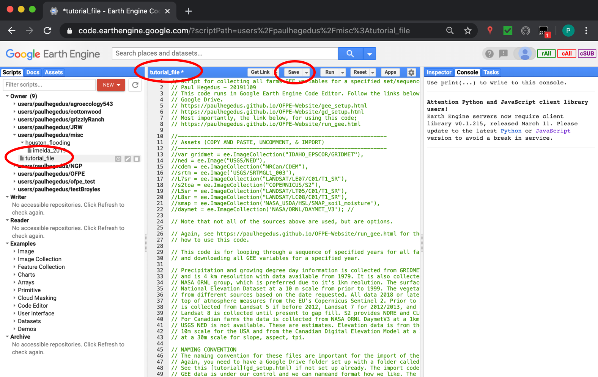
```


**4.** First, for any assets you created in this [tutorial](gee_setup.html), enter all 'farmer_farmername' text strings in Line 88. Do not include the '_bbox' text here that I recommended adding in the tutorial. 

```{r, out.width = "75%", fig.align = "center", fig.cap = "", echo = FALSE}
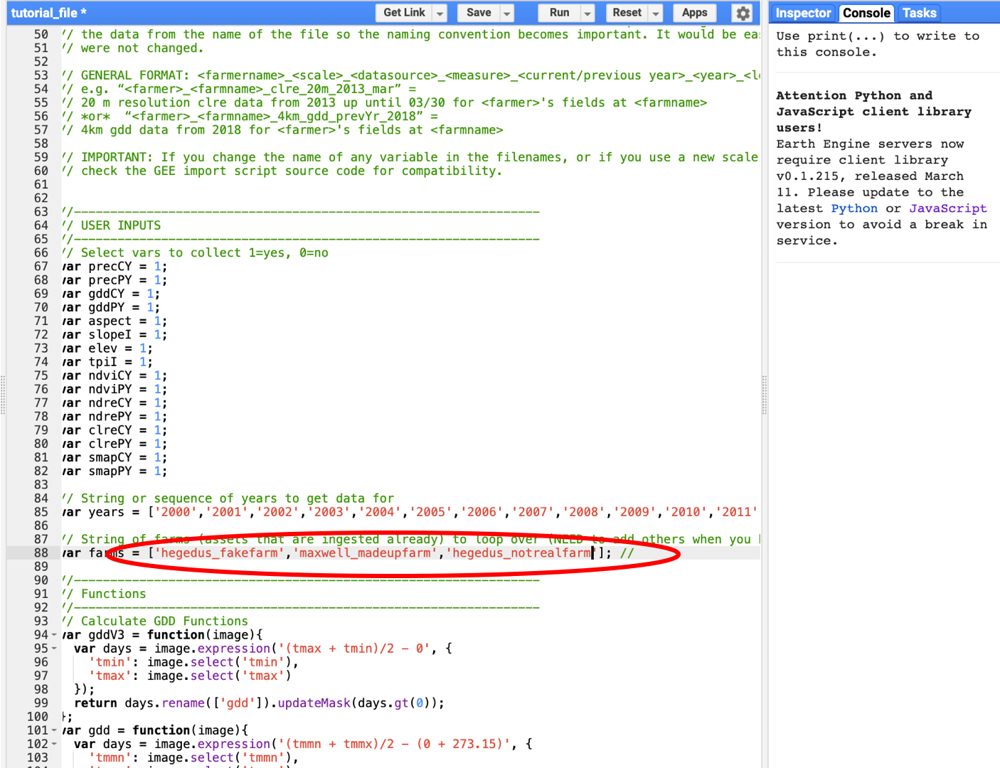
```


**5.** Insert your Google Account Username in line 167. If you did not include '_bbox' at the end of your asset names, remove that from line 167. and make sure it matches your file structure.

```{r, out.width = "75%", fig.align = "center", fig.cap = "", echo = FALSE}
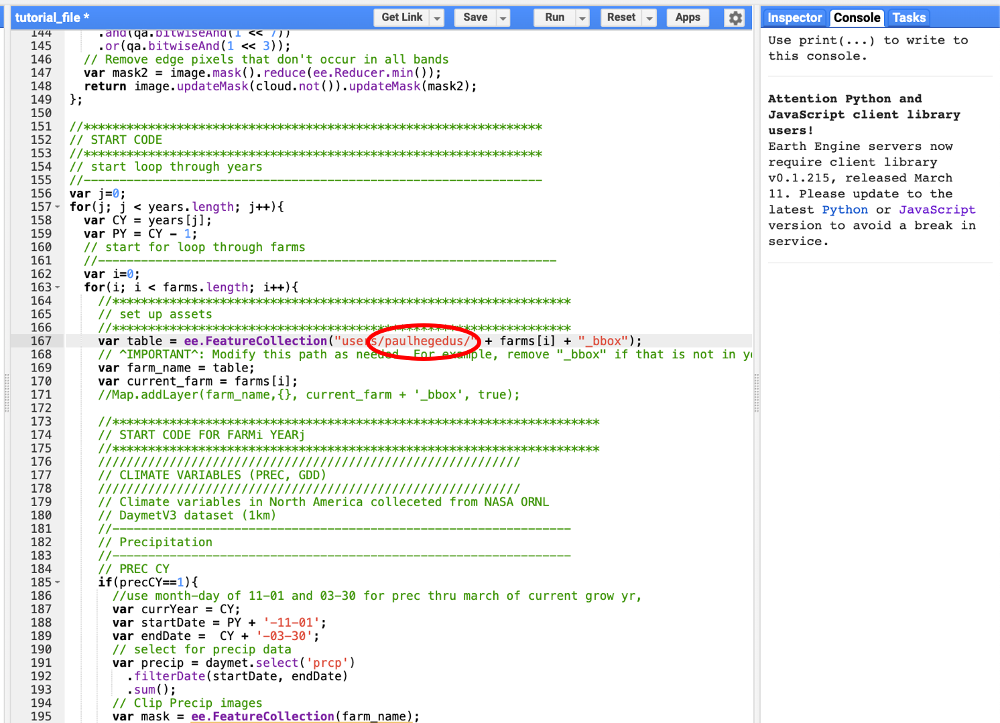
```


**6.** Before moving onto the next section and before you make any edits that add lines to your file, note that the next section will demonstrate how to edit lines 67 - 82, 85, and 88. Remember these lines in case the line numbers do not match up when you edit your script later.

```{r, out.width = "75%", fig.align = "center", fig.cap = "These lines are what we need to edit to change what data is downloaded. Lines 67 - 82 determine the parameters to download, 85 are the years to download data for, and line 88 is the farm boundaries to download data for.", echo = FALSE}
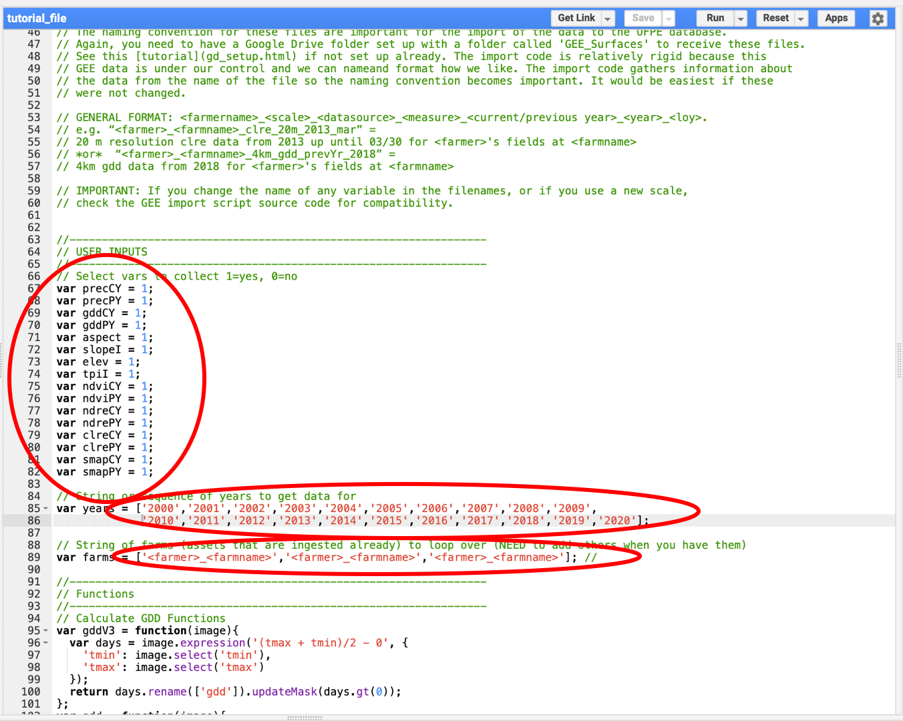
```


**7.** Assets need to be imported into the script before it will work. Copy and paste lines 13 to 22 and uncomment one of the sections. Hover your mouse over the uncommented code and select "Convert" in the pop-up window.

```{r, out.width = "75%", fig.align = "center", fig.cap = "", echo = FALSE}
knitr::include_graphics('run_gee/step_cre_7.png')
```


### Script Editing/Execution
This section of the tutorial is for editing the OFPE script and executing it on an annual basis to collect relevant Google Earth Engine data. It can also be ran as often as required for any specified data.

The script downloaded and set up in the section above has a looped structure so that any combination of parameters, years, and farms can be ran at any time. However, note that any data downloaded always goes to the 'GEE_Surfaces' folder set up in your Google Drive in this [tutorial](gd_setup.html). Additionally, in the process detailed in these [diagrams](dat_import.html), the R script that imports data from Google Drive to the PostgreSQL database will always move all of the data in the Google Drive. So to avoid long processes, keep the Google Drive folder clean.

**1.** Turn parameters on or off by changing their indicator to 1 or 0, respectively. In the image below only weather and vegetation data will be downloaded (precCY, precPY, gddCY, gddPY, ndviCY, ndviPY, ndreCY, ndrePY, clreCY, clrePY).

```{r, out.width = "75%", fig.align = "center", fig.cap = "Note the changes in lines 67 - 82 from the default with ones indicating parameters that will be downloaded.", echo = FALSE}
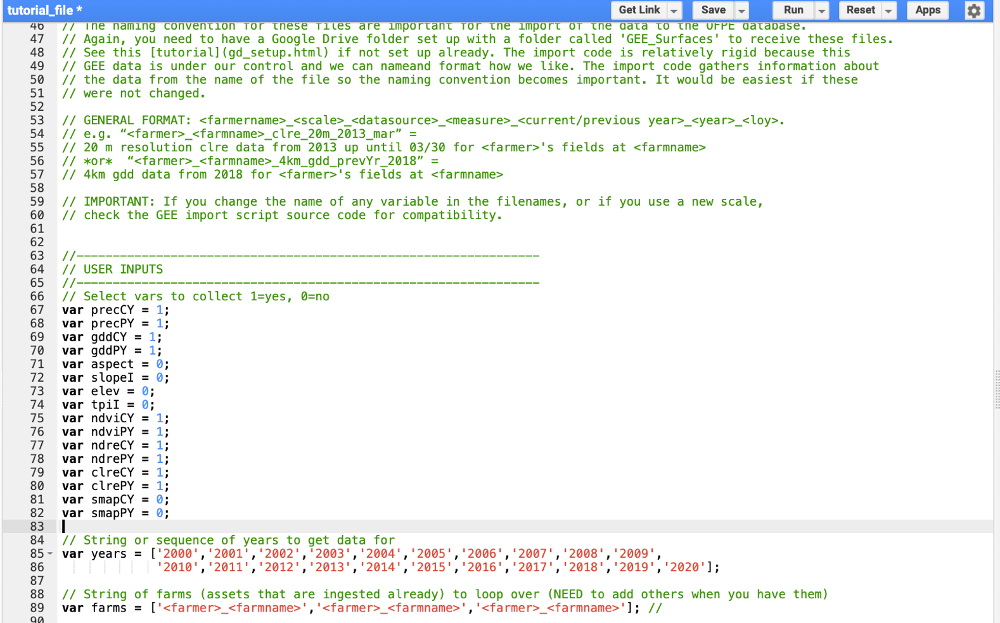
```


**2.** Only include years that you would like to get data for. Data will only be downloaded if it is available for the year you select (i.e. Sentinel 2 data is not available prior to 2016). Remember that CY means that data for that year is gathered from 01-01 to 03-30. PY is the full year, 01-01 to 12-31 or 11-01 to 10-31 for precipitation (water year). So, for example, if you want to download precipitation data from the entirety of 2002, run precPY 2003. If you wanted NDVI data up to the decision point for 2005, run ndviCY 2005.

```{r, out.width = "75%", fig.align = "center", fig.cap = "Note that the years selected here are all years between 2000 and 2020. Any subset or sequence of years can be selected, however if data from the datasets of the parameters you select are not available for those years, you will not get any data.", echo = FALSE}

```


**3.** Add or delete any Asset ID's of farm bounding boxes to get data for. Only include the names of farms you want data for, just like for the years.

```{r, out.width = "75%", fig.align = "center", fig.cap = "In the same line where you added the Asset ID's in the creation tutorial, only keep the farms you want active by deleting or commenting out Asset ID's.", echo = FALSE}

```


**4.** Now click 'Run'. You will see the 'Tasks' tab appear orange if tasks are being initiated.

```{r, out.width = "75%", fig.align = "center", fig.cap = "Note that some aspects of this image may be different. Blacked out sections are for MT OFPE farmer's privacy.", echo = FALSE}
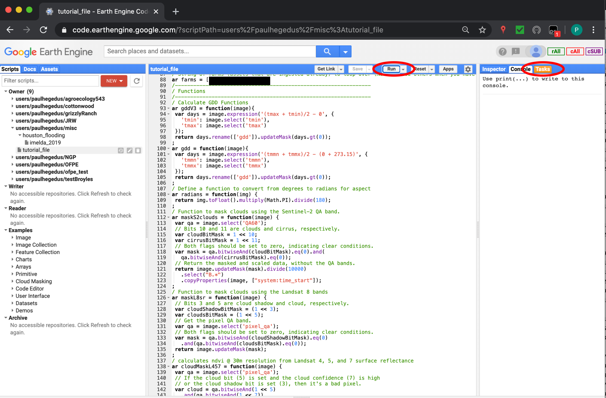
```


**5.** The initiated tasks need to be initialized. For each task, click the blue 'RUN' button. Then click 'Run' in the pop-up window. Repeat this process for every task you initialized.

```{r, out.width = "75%", fig.align = "center", fig.cap = "", echo = FALSE}
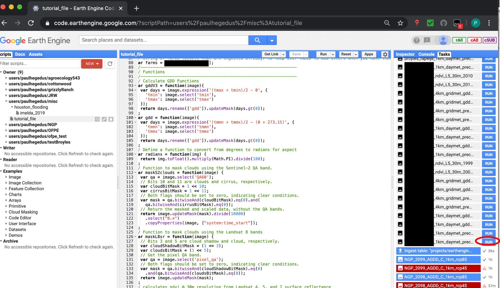
```

```{r, out.width = "75%", fig.align = "center", fig.cap = "Note that some aspects of this image may be different. Blacked out sections are for MT OFPE farmer's privacy.", echo = FALSE}
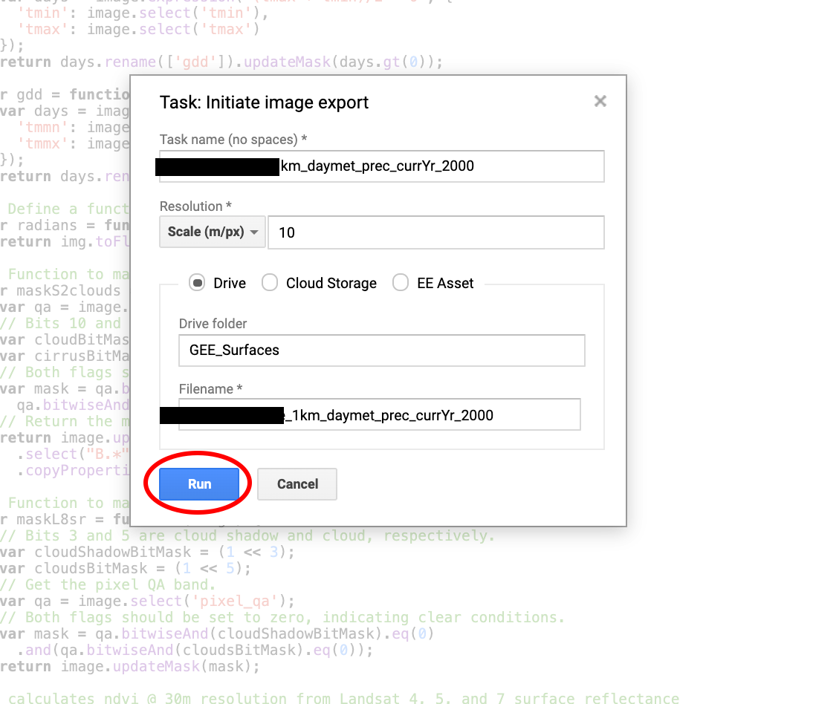
```


**6.** Now would be a good time to give you the link to [Dongdong Kong's](https://github.com/kongdd) [gee_monkey](https://github.com/kongdd/gee_monkey.git) Google Earth Engine add-on that will make Step 5 not your worst nightmare. It's a $10 well spent in my opinion...

```{r, out.width = "75%", fig.align = "center", fig.cap = "", echo = FALSE}
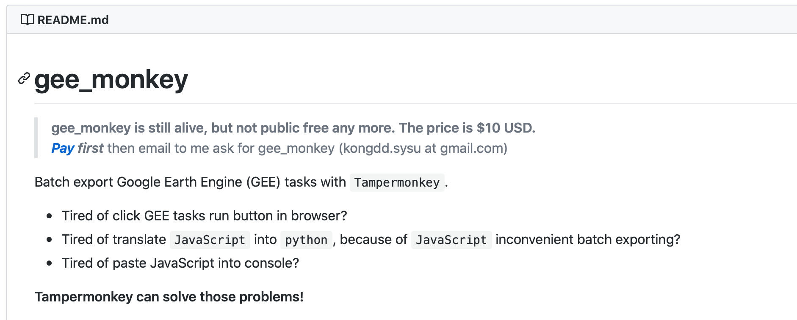
```


Now you've got data downloading from Google Earth Engine and is on it's way to Google Drive. Again, see this [workflow](dat_import.html) for the next steps of importing the Google Earth Engine data to the PostgreSQL database.


