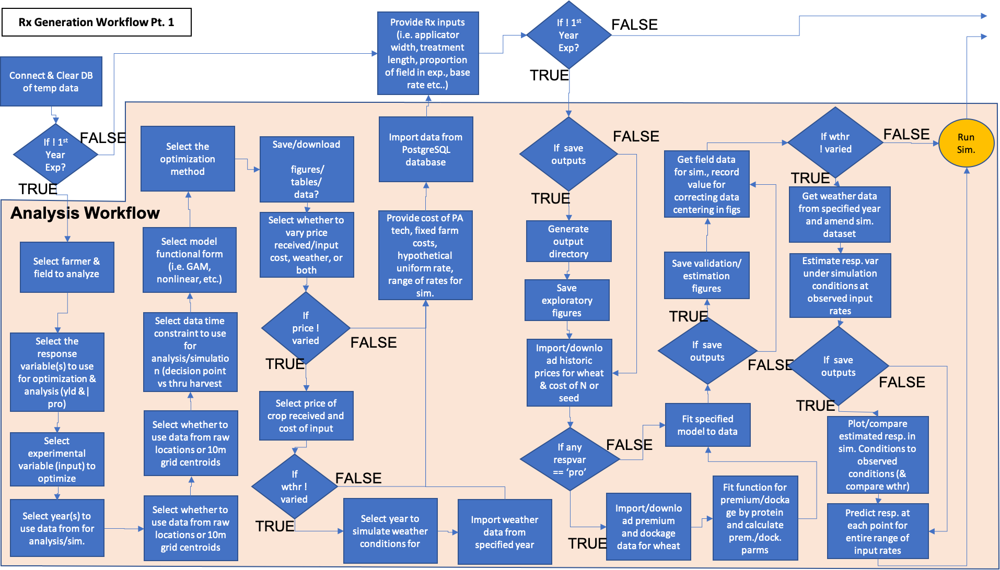
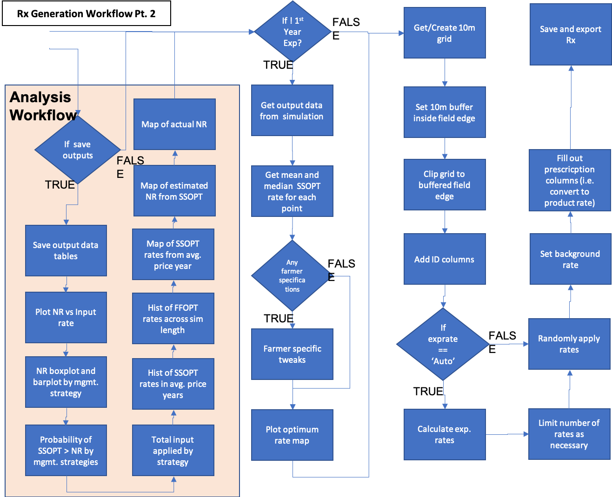
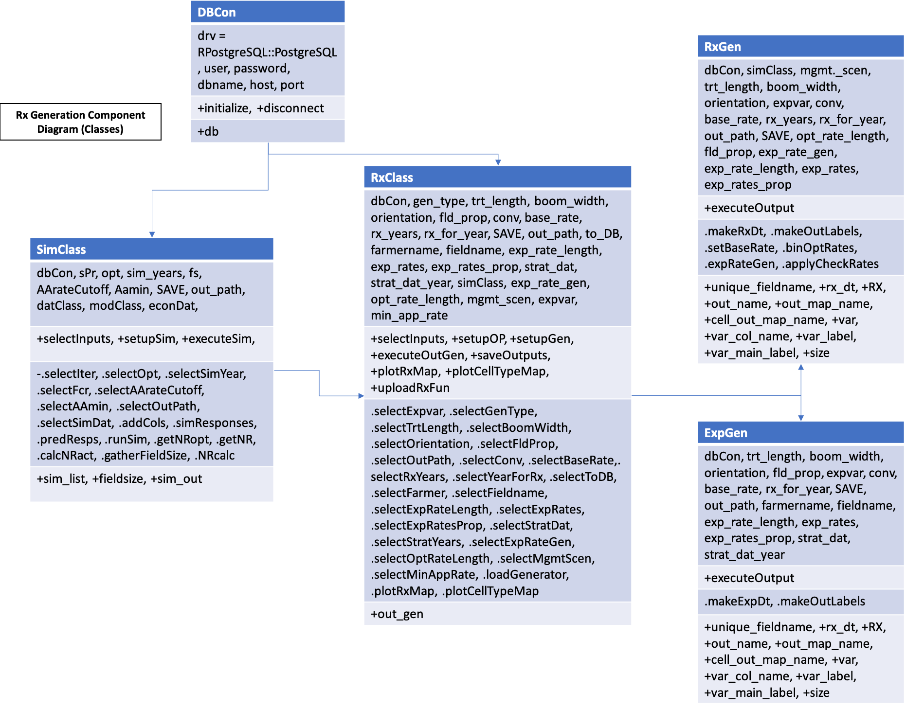

After the user analyzes the field specific data from their specified year and decides on a management strategy, a prescriptive fertilizer or seed map can be generated based on optimizing inputs. This optimization can take the form of profit maximization or profit maximization and pollution minimization. This prescription can reflect a specified price scenario or the *mean/median* of inputs across simulation results. The prescription is exported as a shapefile that the farmer can upload to their equipment and apply the inputs. The user has the option of including experimental rates, with the prescriptive rates as a base, or to make a pure prescription, in which case check rates can be added to the map to assess the how the prescription performs compared to a farmer selected rate. Alternatively, the user can elect to create a new experiment for a field. They must select a field present in the 'all_farms.fields' table of the OFPE database to create the experiment for. The user has the option of stratifying the experiment on previous data available in the database, such as yield, protein, or previous as-applied rates. The user must provide the number of experimental rates to apply if experimental rates are applied, as well as the number of optimum rates to use. In addition to the base rate applied, the sum should equal the equipment limitation on rates applied.

#### Rx Creation
The activity workflow for generating prescriptions is described below in Figure 1 and 2. This workflow follows the same steps as the analysis and simulation process, albeit with some extra input parameters such as equipment and treatment specifications and, optionally, specified experimental rates. If it is not the first year making an experiment, the simualtion is performed under the specified conditions and used to generate optimized rates under the uncertainty surrounding the conditions selected. The optimum rates are used as the background rate and experimental rates are randomly stratified across the field. The resulting prescription is then downloaded to the user as an ESRI shapefile. Whether making an experimental or experimental prescription, the user has the option of choosing experimental rates (or generting rates between optimimum rates for an experimental prescription), and providing the proportion of rates to apply to each. This allows the user to apply more or less of certain rates (i.e. the dreaded zero rates). 

```{r, out.width = "75%", fig.align = "center", fig.cap = "**Figure 1**. Part 1 of the prescription building process. Demonstrates enrichment of yield or protein datasets with remotely sensed covariate data and experimental data collected on-farms. Blue activities are chained together by arrows, and black boxes indicate the addition of user inputs. Diamonds represent logical statements, where FALSE returns are routed from the side of the diamond and TRUE returns are routed from the top or bottom of the diamond.", echo = FALSE}

```

```{r, out.width = "75%", fig.align = "center", fig.cap = "**Figure 2**. Part 2 of the prescription building process. Demonstrates enrichment of yield or protein datasets with remotely sensed covariate data and experimental data collected on-farms. Blue activities are chained together by arrows, and black boxes indicate the addition of user inputs. Diamonds represent logical statements, where FALSE returns are routed from the side of the diamond and TRUE returns are routed from the top or bottom of the diamond.", echo = FALSE}

```


A component diagram outlining the R6 classes used and the inputs required for the generation of a prescription or experiment for a field. Each class is represented by a table with the title of the class as the header, with the first row showing inputs, the second row showing public methods, the third row showing private methods, and an optional fourth row showing any tangible outputs from the class. 

```{r, out.width='100%', fig.align='center', fig.cap='**Figure 3.** Component diagram for the creation of an experiment or prescription for a field. The user can either initialize the RxClass with just a database connection to select a field for an experiment, or can pass in an executed SimClass object to the RxClass. This then calls either the RxGen or ExpGen classes to generate the experiment or prescription map, outputted and returned by the RxClass', echo = FALSE}

```


