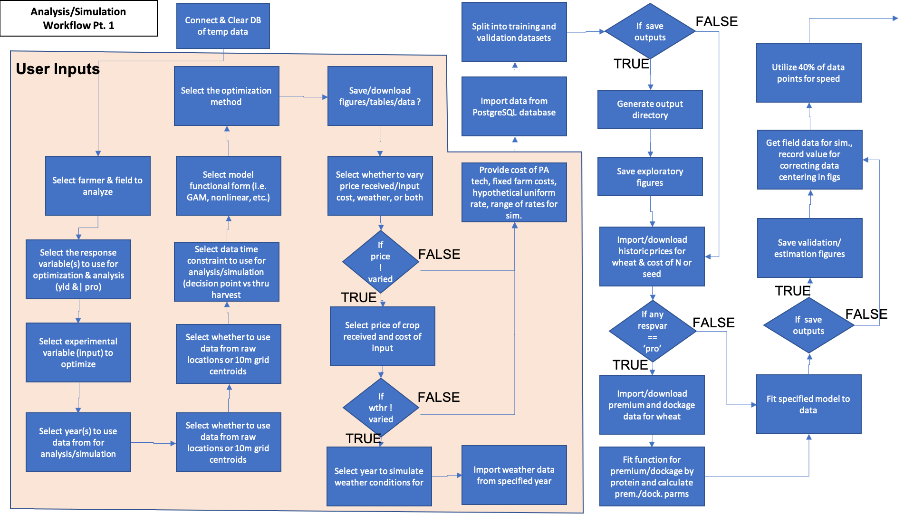
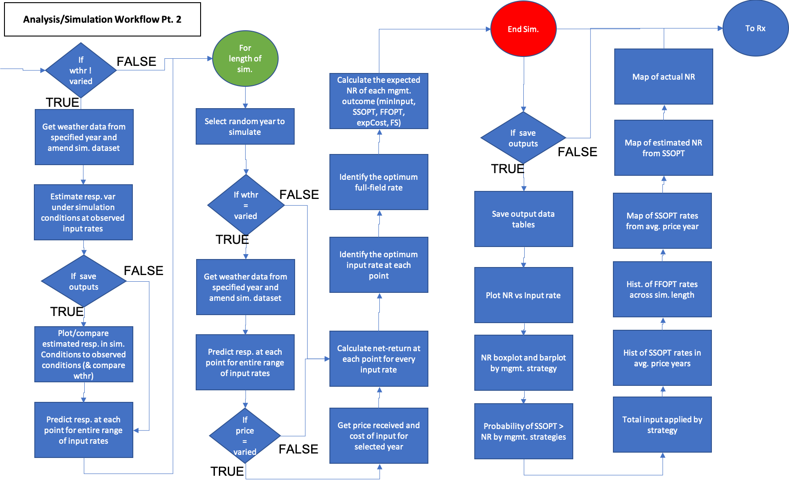

Once all explanatory and covariate data is aggregated to the response data observations, it can be used to train models of crop production (yield) or quality (protein). Experimentally varying input rates (fertilizer or seed) is crucial to developing the function for the relationship between the crop response and input. These models are then used in a Monte Carlo simulation that randomly selects an economic condition (winter wheat price, price of fertilizer or seed) to generate the probability of outcomes. Because the farmer has to make a decision on their input rates by March 30th for winter wheat, the farmer will not know the weather conditions for the rest of the growing season, so the user will be able to select a year or scenario to simulate. 

#### Execute Simulation/Analysis
The activity workflow for simulating management outcomes is described below in Figures 1 and 2. Analysis and simulation require the user to select the field of interest and variables to optimize on (yield and/or protein) and other data specifications, farm specific parameters such as fixed costs and farmer selected input rates, and parameters related to the simulation, such as whether to vary prices, weather, or both. The user also has control over the model functional type used and how to optimize the input. The simulation is a Monte-Carlo simulation that iteratively selects a year from a period of record from which to predict crop responses and net-returns under that year's observed price and or weather conditions. The user can provide a data frame with ranges of prices received and the cost of the experimental variable. After the simulation, the probability of the site-specific optimization management strategy can be compared to other strategies such as the minimum rate of input (typically zero for nitrogen fertilzier, non-zero for seeding rates), the farmer selected uniform rate, the full-field optimized rate, if the actual experiment applied in the simulated year, and if the crop was grown in the opposite system type. For example, if the farmer grows conventional wheat, this would be the mangement case where zero fertilizer is applied and an organic price is received. If the farmer is an organic grower, than this managmenet scenario is simply the farmer selected rate with conventional prices received. The user can use this tool to simulate different management outcomes under various economic and climate scenarios to decide conditions for which to make an input prescription for the upcoming year.

```{r, out.width = "75%", fig.align = "center", fig.cap = "**Figure 1**. Part 1 of the data analysis and simulation process. Demonstrates enrichment of yield or protein datasets with remotely sensed covariate data and experimental data collected on-farms. Blue activities are chained together by arrows, and black boxes indicate the addition of user inputs. Diamonds represent logical statements, where FALSE returns are routed from the side of the diamond and TRUE returns are routed from the top or bottom of the diamond.", echo = FALSE}

```

```{r, out.width = "75%", fig.align = "center", fig.cap = "**Figure 2**. Part 2 of the data analysis and simulation process. Demonstrates enrichment of yield or protein datasets with remotely sensed covariate data and experimental data collected on-farms. Blue activities are chained together by arrows, and black boxes indicate the addition of user inputs. Diamonds represent logical statements, where FALSE returns are routed from the side of the diamond and TRUE returns are routed from the top or bottom of the diamond.", echo = FALSE}

```


A component diagram outlining the R6 classes used and the inputs required for the analysis and simulation of a user selected field for a set of years for model fitting and years to simulate management outcomes in. Each class is represented by a table with the title of the class as the header, with the first row showing inputs, the second row showing public methods, the third row showing private methods, and an optional fourth row showing any tangible outputs from the class. 

```{r, out.width='100%', fig.align='center', fig.cap='**Figure 3.** Component diagram for the data analysis and simulation steps of the OFPE data cycle. The user must intialize and setup the DatClass to hold analysis and simulation data, a ModClass object which intializes a specified model class that fits the model for each response variable, and a class containing economic data. These are used with the database connection to intialize a SimClass object which executes the MonteCarlo simulation and feeds into the SimOP class that saves and returns outputs from the simulation.', echo = FALSE}

```


